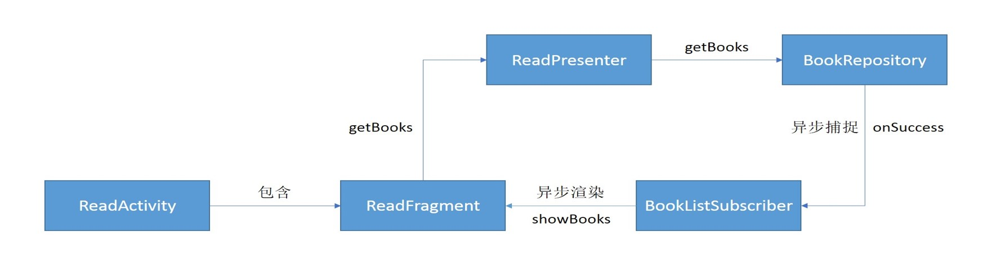

## MVP结构介绍

一个完整的MVP三层结构需要包括：

* xxRepository  M层，获取需要展示的数据
* xxContract  VP层协议接口，内部分别包含了V层和P层接口
* xxPresenter  P层，需要实现 xxContract 中的 IPresenter 接口
* xxSubscriber  rxAndroid 观察者，对 M层的异步结构进行捕捉处理（xxSubscriber 可以作为 xxPresenter 内部类，也可单独放在 subscriber 包下进行复用）
* xxActivity  V层的壳，layout 文件中只存在 FrameLayout 用于显示 Fragment，需要添加上路由信息及完成 VP层装配
* xxFragment  V层，需要实现 xxContract 中的 IView 接口

### 路由信息

```java
@Route(path = RouterConstant.READ_PAGE)
public class ReadActivity extends BaseActivity {...}
```

### VP层装配

```java
public class ReadActivity extends BaseActivity {

    ReadFragment mReadFragment;

    @Override
    protected int getLayoutResource() {...}

    @Override
    protected int getFragmentContainerId() {...}

    @Override
    protected void onInitView() {
        mReadFragment = getStoredFragment(ReadFragment.class);
        // 一个 fragment 可对应多个 VP
        new ReadPresenter(mReadFragment, new BookRepository(this));
        addFragment(mReadFragment);
    }
}
```

### MVP各层分割及对应关系

* VP层为一对一关系，数据的展示和相应加工过程对应
* Fragment和VP层为一对一关系
* VP层和M层为多对一关系
* 复杂的页面，Activity和Fragment关系可为一对一，也可为一对多

## 完整的MVP流程示例

ereader-read 模块中，包含一个完整 MVP 流程显示图书信息的示例



### BookRepository 类

M层实现类，从本地数据库获取图书的相关信息

* 需继承 BaseRepository 类
* 构造函数中获取需要的 DAO
* 其他方法需返回 Observable&lt;T&gt; 对象，通过 RxUtil.toObservable 可将同步操作变为异步

```java
public class BookRepository extends BaseRepository {

    private BookDao mBookDao;

    public BookRepository(RxLifecycleBinder binder) {
        super(binder);
        mBookDao = DbHelper.getInstance().getSession().getBookDao();
    }

    public Observable<List<Book>> getBooks() {
        return RxUtil
                .toObservable(() -> mBookDao.loadAll())
                .compose(defaultRxConfig());
    }
}
```

### ReadContract 接口

VP层协议接口，内部分别包含了V层和P层接口

* IView 接口需继承 BaseView&lt;IPresenter&gt;，IPresenter 接口需继承 BasePresenter
* IView 定义的接口方法用于数据展示
* IPresenter 定义的接口方法用于获取相应的数据，或者执行相应的数据加工过程

```java
public interface ReadContract {

    interface IView extends BaseView<IPresenter> {

        void onGetBooks(List<Book> books);

        void showTips(String text);
    }

    interface IPresenter extends BasePresenter {

        void getBooks();
    }
}
```

### ReadPresenter 类

P层实现类

* 需要实现 ReadContract.IPresenter 接口，并实现接口中的方法
* 构造方法中，完成与相应 View 的装配
* 实现接口方法时，若是需要从 M层获取数据，则需对 M层返回的 Observable&lt;T&gt; 对象设置相应的观察者

```java
public class ReadPresenter implements ReadContract.IPresenter {

    private ReadContract.IView mView;
    private BookRepository mRepository;

    public ReadPresenter(@NonNull ReadContract.IView view, BookRepository repository) {
        mView = view;
        mView.setPresenter(this);	// 与 View 装配
        mRepository = repository;
    }

    @Override
    public void getBooks() {
        mRepository.getBooks().subscribe(new BookSubscriber());
    }
}
```

### BookListSubscriber 类

rxAndroid 观察者，捕捉处理 BookRepository 中 getBooks 方法的结果（此处实现为 ReadPresenter 的内部类）

```java
public class ReadPresenter implements ReadContract.IPresenter {

    private ReadContract.IView mView;
    
    ...

    private class BookListSubscriber extends BaseDbSubscriber<List<Book>> {

        @Override
        protected void onSuccess(List<Book> books) {
            mView.onGetBooks(books);
        }

        @Override
        protected void onFailure(Throwable e) {
            mView.showTips(e.getMessage());
        }
    }
}
```

### ReadActivity 类

阅读页，V层，但具体的 UI 放在 fragment 中

* 需继承 BaseActivity 类，并添加路由信息
* getLayoutResource 方法返回相应 layout 文件 id，该 layout 文件中需包含 FrameLayout；getFragmentContainerId 方法返回 FrameLayout 的 id
* onInitView 方法中，完成 fragment 的初始化以及VP层的装配，一个 fragment 可对应多个 VP

```java
@Route(path = RouterConstant.READ_PAGE)
public class ReadActivity extends BaseActivity {

    ReadFragment mReadFragment;

    @Override
    protected int getLayoutResource() {
        return R.layout.activity_read;
    }

    @Override
    protected int getFragmentContainerId() {
        return R.id.fl_read_activity;
    }

    @Override
    protected void onInitView() {
        mReadFragment = getStoredFragment(ReadFragment.class);
        new ReadPresenter(mReadFragment, new BookRepository(this));
        addFragment(mReadFragment);
    }
}
```

activity_read.xml 内容如下

```xml
<?xml version="1.0" encoding="utf-8"?>
<android.support.v4.widget.DrawerLayout xmlns:android="http://schemas.android.com/apk/res/android"
    xmlns:tools="http://schemas.android.com/tools"
    android:layout_width="match_parent"
    android:layout_height="match_parent"
    tools:context=".ui.activity.ReadActivity">

    <FrameLayout
        android:id="@+id/fl_read_activity"
        android:layout_width="match_parent"
        android:layout_height="match_parent">
    </FrameLayout>

</android.support.v4.widget.DrawerLayout>
```

### ReadFragment 类

实际的V层

* 需要继承 BaseFragment 类，并实现 ReadContract.IView 接口，同时实现接口中的方法
* getLayoutResource 方法返回相应 layout 文件 id
* onInitView 方法中完成界面的初始化，包括组件的获取以及各种事件的初始化

```java
public class ReadFragment extends BaseFragment implements ReadContract.IView {

    private ReadContract.IPresenter mPresenter;

    private TextView mTextView;

    @Override
    protected int getLayoutResource() {
        return R.layout.fragment_read;
    }

    @Override
    protected void onInitView() {
        mTextView = findViewById(R.id.read_content);
    }

    @Override
    protected void onLoadData() {
        mPresenter.getBooks();
    }

    @Override
    public void setPresenter(ReadContract.IPresenter presenter) {
        mPresenter = presenter;
    }

    @Override
    public void onGetBooks(List<Book> books) {
        mTextView.setText(books.toString());
    }

    @Override
    public void showTips(String text) {
        ToastUtil.showText(text);
    }
}
```

